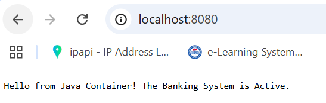

# 🏦 Bank Status Monitor (Java + Docker)

A lightweight, containerized application that demonstrates how to run a custom **Java backend** alongside a **MySQL** database using **Docker** and **Docker Compose**.

This project is designed for learning purposes and avoids heavy frameworks, focusing instead on core Java and container fundamentals.

---

## 🏗 Project Architecture

This project follows a simple microservices-style architecture composed of two main services:

### 🔹 Backend Service
- **Language:** Java 17 (Standard Edition)
- **HTTP Server:** `com.sun.net.httpserver`
- **Frameworks:** None (No Spring, No Jakarta EE)
- **Base Image:** `eclipse-temurin:17-jdk-alpine`
- **Purpose:** Handles HTTP requests and communicates with the database

### 🔹 Database Service
- **Database:** MySQL 8.0
- **Persistence:** Docker Volumes
- **Purpose:** Stores application data and persists it across container restarts

### 🔹 Orchestration
- **Tool:** Docker Compose
- **Role:** Manages service startup, networking, and dependencies between the Java app and MySQL

---

## 🖼 Backend Screenshot



---

## 🚀 How to Start the Application

Make sure **Docker** and **Docker Compose** are installed on your system.

### Step 1: Build and run containers
```bash
docker-compose up --build
```
### Project Structure 
## 📂 Project Structure

```text
java-docker-lab/
├── app/
│   ├── Server.java        # Core Java HTTP Server logic
│   └── Dockerfile         # Instructions to compile and package the Java app
├── docker-compose.yml     # Defines the services (Web App + Database) and networks
└── README.md              # Project documentation